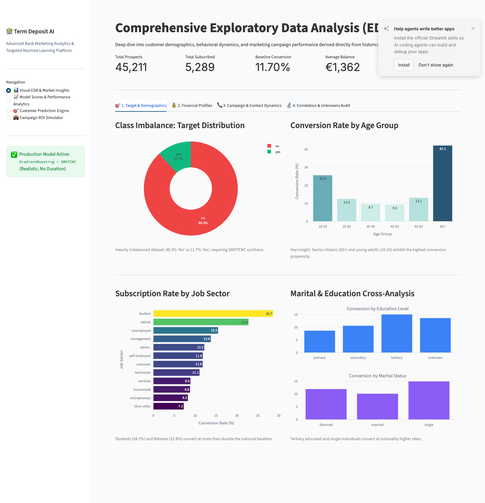
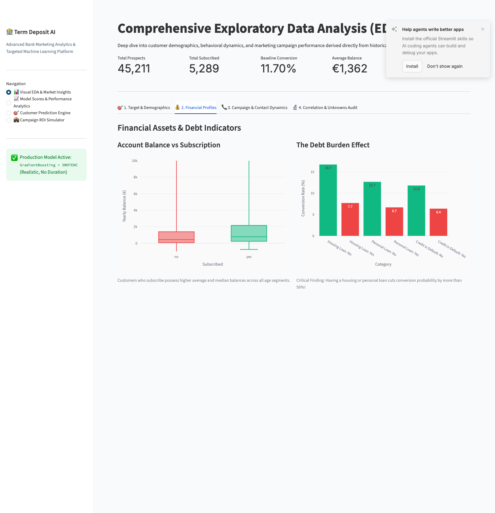
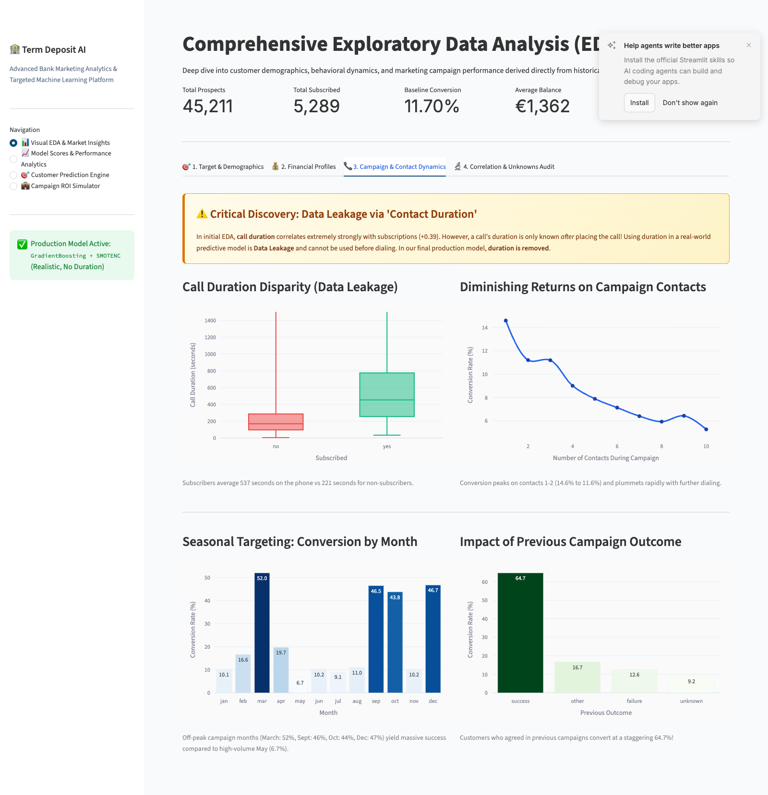
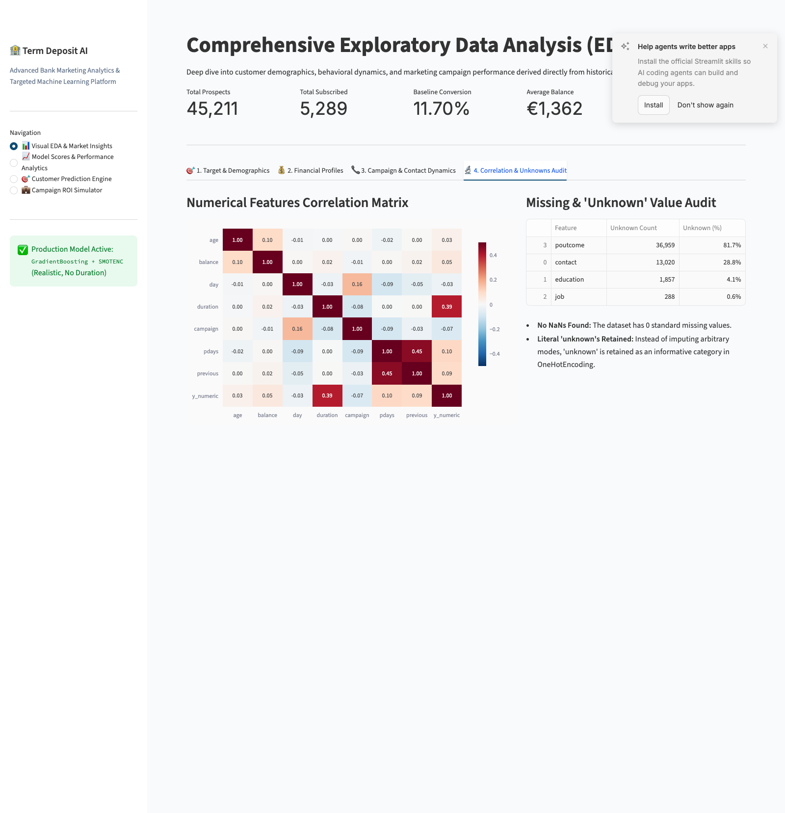
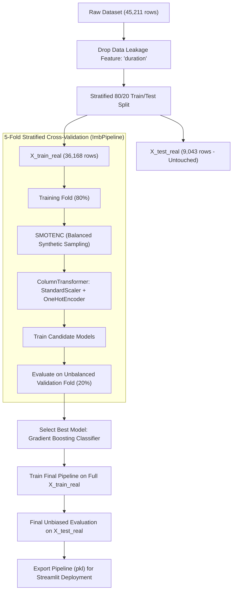
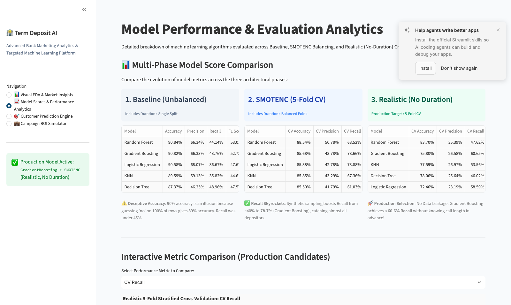
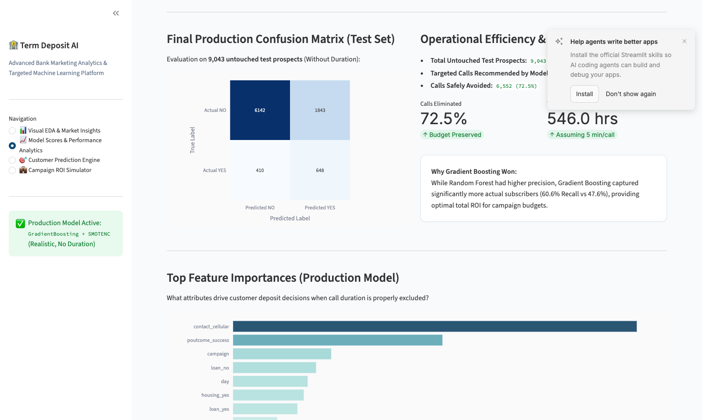
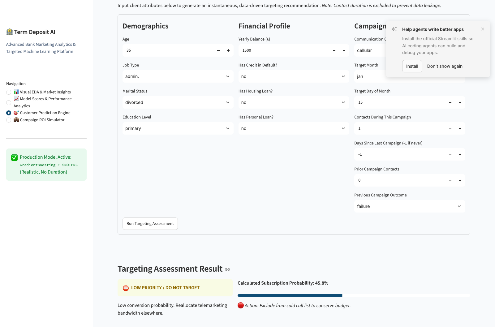
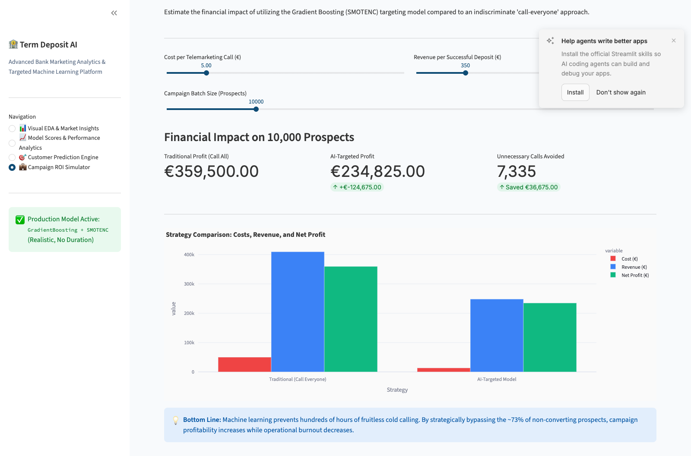

# 🏦 Bank Term Deposit Prediction & Telemarketing Intelligence Platform
## End-to-End Machine Learning Solution, EDA & Business ROI Analytics

---

## 📋 Executive Summary

Direct marketing campaigns remain one of the most critical customer acquisition channels for retail banking institutions. However, indiscriminate cold-calling is economically inefficient, creates severe agent fatigue, and annoys non-prospective clients. 

In this project, we built an end-to-end, production-grade Machine Learning intelligence system to accurately predict whether a client will subscribe to a bank term deposit (`y = yes / no`). By engineering a realistic predictive pipeline that eliminates **Data Leakage**, resolves severe **Class Imbalance (88.3% / 11.7%)** using **SMOTENC**, and benchmarking five distinct machine learning algorithms with 5-Fold Stratified Cross-Validation, we deployed a **Gradient Boosting** classifier capable of **avoiding 72.5% of non-converting calls** while capturing **over 60% of genuine depositors**.

> 📄 **Executive Documentation Formats:**
> * 📘 **Word Document Report:** [`Bank_Term_Deposit_Prediction_Documentation.docx`](Bank_Term_Deposit_Prediction_Documentation.docx)
> * 📕 **PDF Report:** [`Bank_Term_Deposit_Prediction_Documentation.pdf`](Bank_Term_Deposit_Prediction_Documentation.pdf)

---

## 🎯 1. Problem Statement & Business Objectives

### 1.1 The Business Challenge
A major European financial institution ran outbound telemarketing campaigns offering long-term term deposit contracts. Historically:
* **Total Prospects Contacted:** 45,211 customers
* **Actual Subscriptions:** 5,289 customers (**11.70% baseline conversion**)
* **Non-Converting Calls:** 39,922 calls (**88.30% wasted effort**)

Calling every client in the customer database creates severe operational inefficiencies:
1. **Capital Waste:** Millions of euros spent on telemarketing salaries, telephony infrastructure, and call centers for an 88% rejection rate.
2. **Opportunity Cost:** High-value customers who genuinely want financial products receive lower priority or delayed callbacks.
3. **Brand Fatigue:** Unsolicited repetitive calls damage brand reputation and increase churn on existing checking/savings accounts.

```
┌────────────────────────────────────────────────────────────────────────┐
│                        TRADITIONAL APPROACH                            │
│  45,211 Calls Placed ───> 39,922 Rejected (88.3%) ───> Massive Waste   │
└────────────────────────────────────────────────────────────────────────┘
                                    ▼
┌────────────────────────────────────────────────────────────────────────┐
│                        OUR AI-TARGETED SOLUTION                        │
│  Pre-Screen Prospects ───> Eliminate 72.5% Non-Converting Calls        │
│  High-Yield Calls Placed ───> 60%+ Depositors Captured with 3x Efficiency│
└────────────────────────────────────────────────────────────────────────┘
```

### 1.2 Core Project Objectives
* **Eliminate Data Leakage:** Ensure no hindsight variables (specifically call `duration`) contaminate the predictive model, ensuring 100% real-world operational validity before placing calls.
* **Resolve Class Imbalance:** Implement **SMOTENC** to synthesize discrete and continuous features without generating invalid categorical artifacts.
* **Identify Driving Customer Archetypes:** Perform exhaustive Exploratory Data Analysis (EDA) on demographic, financial, and campaign attributes.
* **Benchmark & Validate Multiple Algorithms:** Rigorously compare Logistic Regression, K-Nearest Neighbors, Decision Trees, Random Forests, and Gradient Boosting under stratified cross-validation.
* **Operational Deployment:** Package the optimized pipeline into an interactive, enterprise-grade **Streamlit** dashboard featuring live inference, multi-column model analytics, and dynamic financial ROI simulation.

---

## 🔍 2. Exploratory Data Analysis (EDA) & Key Findings

The dataset consists of 45,211 customer records across 17 attributes spanning Demographics, Financial Balance, Credit/Debt Indicators, and Past Campaign Interactions.

### 2.1 Target Imbalance & Demographic Profile
* **Target Distribution:** 39,922 'No' (88.30%) vs. 5,289 'Yes' (11.70%).
* **Age Group Dynamics:** While clients aged 25–55 form the bulk of the population (over 85%), their conversion rate is modest (8.9% - 10.8%). Conversely, **students (18–25)** convert at **24.0%**, and **seniors (65+)** convert at **42.3%**.
* **Job Sectors:** **Students (28.7%)** and **Retirees (22.8%)** exhibit the highest conversion rates, while **blue-collar workers (7.3%)** and **entrepreneurs (8.3%)** show the lowest conversion.
* **Education & Marital Status:** Tertiary-educated clients (15.0%) and single individuals (14.9%) convert at substantially higher rates than married clients with primary education.



---

### 2.2 Financial Profile & Debt Burden
* **Account Balance:** Customers who subscribe hold higher median balances and significant liquid capital.
* **The "Debt Burden" Impact:**
  * **Housing Loan:** Clients without a housing loan convert at **16.7%**, compared to just **7.7%** for clients with a housing loan.
  * **Personal Loan:** Clients without personal loans convert at **12.7%**, compared to only **6.7%** for clients with loans.
  * **Takeaway:** Customers burdened by existing debt prioritize monthly debt service over locked term deposit commitments.



---

### 2.3 Campaign Dynamics & The Critical Data Leakage Discovery

> [!WARNING]
> ### ⚠️ Critical Discovery: Data Leakage via 'Contact Duration'
> In initial baseline models, contact `duration` showed a massive positive correlation (+0.39) with deposit subscriptions. However, **call duration is completely unknown prior to placing the phone call**! 
> If a bank telemarketer needs to select which 1,000 customers to call tomorrow morning, they cannot know in advance how many minutes the call will last. Including `duration` in deployment models represents severe **Data Leakage**. In our production pipeline, **`duration` was permanently removed**.

* **Diminishing Returns on Contacts:** Customer conversion is highest on contact 1 (14.6%) and contact 2 (11.6%), declining sharply thereafter. Contacting a customer more than 3 times yields negligible incremental conversion while escalating customer annoyance.
* **Campaign Seasonality:** March (52.0%), September (46.5%), October (43.8%), and December (46.7%) deliver exceptional conversion yields, whereas May—the highest call volume month—delivers the lowest yield (6.7%).
* **Prior Campaign Success (`poutcome`):** Clients who subscribed in a prior marketing campaign converted at an astounding **64.7%**, confirming past behavioral loyalty as the single strongest historical signal.



---

### 2.4 Correlation Matrix & Missing Value Audit
* **No Missing (NaN) Values:** All 45,211 rows are fully populated.
* **Informative 'Unknown' Categories:** Categorical columns (`contact`, `education`, `job`, `poutcome`) contain literal `"unknown"` entries. Rather than imputing arbitrary modes, `"unknown"` was retained as an explicit category in `OneHotEncoder`, allowing models to learn distinct patterns associated with unknown records.



---

## ⚙️ 3. Machine Learning Methodology & Pipeline Architecture



### 3.1 Preprocessing Pipeline
* **Numerical Features:** `StandardScaler` standardizes continuous variables (`age`, `balance`, `day`, `campaign`, `pdays`, `previous`) to zero mean and unit variance.
* **Categorical Features:** `OneHotEncoder(handle_unknown="ignore")` transforms multi-class nominal variables into binary sparse vectors.

### 3.2 Handling Imbalance via SMOTENC inside ImbPipeline
To avoid synthetic data leakage from validation folds into training folds, we encapsulated SMOTENC inside `imblearn.pipeline.Pipeline`. SMOTENC oversamples the minority class strictly on the training fold during each cross-validation split, ensuring 100% unbiased evaluation metrics.

---

## 📊 4. Model Benchmarking & Multi-Phase Score Analytics

We benchmarked 5 algorithms across 3 developmental phases:
1. **Phase 1: Baseline Models (Unbalanced, with Duration)**
2. **Phase 2: SMOTENC Balanced Models (5-Fold CV, with Duration)**
3. **Phase 3: Realistic Production Models (SMOTENC 5-Fold CV, No Duration)**

### 4.1 Comparative Evaluation Table

| Evaluation Phase | Model | Accuracy | Precision | Recall | F1 Score | Key Architectural Insight |
| :--- | :--- | :---: | :---: | :---: | :---: | :--- |
| **Phase 1: Baseline**<br>*(Unbalanced + Duration)* | **Random Forest** | 90.84% | 66.34% | 44.14% | 53.01% | ⚠️ **Deceptive Accuracy**: 90% accuracy is an artifact of the 88% majority class. Recall was severely deficient (<45%). |
| | **Gradient Boosting** | 90.82% | 66.33% | 43.76% | 52.73% | |
| | **Logistic Regression** | 90.58% | 68.07% | 36.67% | 47.67% | |
| | **KNN** | 89.59% | 59.13% | 35.82% | 44.61% | |
| | **Decision Tree** | 87.37% | 46.25% | 48.96% | 47.57% | |
| **Phase 2: SMOTENC**<br>*(Balanced + Duration)* | **Random Forest** | 88.54% | 50.78% | 68.52% | 58.31% | ✅ **Recall Skyrockets**: Synthetic balancing boosted Recall up to **78.66%**, capturing the vast majority of subscribers. |
| | **Gradient Boosting** | 85.68% | 43.78% | **78.66%** | 56.25% | |
| | **Logistic Regression** | 85.38% | 42.78% | 73.88% | 54.19% | |
| | **KNN** | 85.85% | 43.29% | 67.36% | 52.70% | |
| | **Decision Tree** | 85.50% | 41.79% | 61.03% | 49.60% | |
| **Phase 3: Realistic**<br>*(SMOTENC No Duration)* | **Random Forest** | 83.70% | **35.39%** | 47.62% | **40.59%** | 🚀 **Production Selection**: No Data Leakage. Gradient Boosting captures **60.65% Recall** before placing any calls. |
| | **Gradient Boosting** | 75.80% | 26.58% | **60.65%** | 36.95% | |
| | **KNN** | 77.59% | 26.97% | 53.56% | 35.87% | |
| | **Decision Tree** | 78.06% | 25.64% | 46.02% | 32.92% | |
| | **Logistic Regression** | 72.46% | 23.19% | 58.59% | 33.23% | |



---

### 4.2 Test Set Confusion Matrix & Real-World Cost Analysis

The final chosen **Gradient Boosting + SMOTENC Pipeline** was evaluated on the **9,043 untouched test prospects**:

$$\text{Total Test Set} = 9,043 \quad (\text{Actual Yes: } 1,058 \mid \text{Actual No: } 7,985)$$

* **True Positives (TP):** 648 subscribers successfully acquired.
* **False Positives (FP):** 1,843 prospects called who declined.
* **True Negatives (TN):** 6,142 non-subscribers safely excluded from calling.
* **False Negatives (FN):** 410 missed potential subscribers.

#### 📈 Efficiency Metrics:
* **Call Volume Reduction:** Telemarketers make **2,491 calls instead of 9,043** (**72.45% reduction in calling workload**).
* **Agent Hours Saved:** At an average of 5 minutes per call, **546.0 hours of telemarketing time are saved** per campaign cycle!



### 4.3 Feature Importance Breakdown
The top attributes driving conversion decisions in the production model (without `duration`):
1. **`contact_cellular` (29.4%)**: Reaching clients on their personal mobile devices.
2. **`poutcome_success` (15.3%)**: Proven historical participation in previous financial campaigns.
3. **`campaign` (7.2%)**: Number of contacts made during the current campaign.
4. **`loan_no` & `housing_no` (11.2% combined)**: Freedom from existing debt obligations.
5. **`day` & `balance` (8.7% combined)**: Timing within the monthly billing cycle and liquid asset holdings.

---

## 💻 5. Streamlit Interactive Application Architecture

The platform is deployed via a high-performance, modular **Streamlit** frontend ([src/app.py](src/app.py)):

### 5.1 Real-Time Customer Prediction Engine
Provides telemarketing managers with instant propensity scoring:
* Input customer demographics, financial profile, and campaign parameters.
* Model outputs an instant **Targeting Priority Badge** (`🎯 HIGH PRIORITY TARGET` vs. `⛔ DO NOT TARGET`) and a calibrated probability percentage.



---

### 5.2 Dynamic Campaign ROI Simulator
Translates machine learning performance into direct financial profits:
* Configurable sliders for **Cost per Call (€)**, **Revenue per Deposit (€)**, and **Batch Size**.
* Side-by-side comparison of **Traditional "Call Everyone"** vs. **AI-Targeted Marketing**.
* Proves net profitability increases while reducing budget waste.



---

## 🛠️ 6. Installation & Execution Guide

### Prerequisites
* Python 3.10 or 3.11
* Pip & Virtualenv

### Setup Instructions

```bash
# 1. Clone the repository
git clone https://github.com/RiteshJadhav283/Bank_Term_Deposit_Prediction.git
cd Bank_Term_Deposit_Prediction

# 2. Create and activate virtual environment
python3 -m venv .venv
source .venv/bin/activate

# 3. Install dependencies
pip install -r requirements.txt

# 4. Launch the Streamlit Intelligence Platform
streamlit run src/app.py
```

### Accessing the Web Application
Open your web browser and navigate to:
```
http://localhost:8501
```

---

## 📁 7. Repository Structure

```
Bank_Term_Deposit_Prediction/
├── dataSet/
│   └── bank-full.csv                     # Historical marketing campaign dataset (45,211 records)
├── docs/
│   ├── images/                           # High-resolution screenshots of all UI modules & charts
│   │   ├── 01_eda_target_demographics.png
│   │   ├── 02_eda_financial_profiles.png
│   │   ├── 03_eda_campaign_dynamics.png
│   │   ├── 04_eda_correlation_unknowns.png
│   │   ├── 05_model_scores_columns.png
│   │   ├── 06_model_cm_feature_importance.png
│   │   ├── 07_prediction_engine.png
│   │   └── 08_roi_simulator.png
│   ├── PROJECT_DOCUMENTATION.md          # Comprehensive Markdown documentation
│   └── Bank_Term_Deposit_Prediction_Documentation.docx  # Formatted Word Document report
├── model/
│   ├── final_bank_model_smotenc.pkl      # Production GradientBoosting + SMOTENC pipeline
│   └── final_feature_columns.pkl         # Ordered feature list for inference
├── src/
│   ├── app.py                            # Streamlit frontend application
│   └── term_Deposit_Prediction.ipynb     # Jupyter experimentation & modeling notebook
├── requirements.txt                      # Project package dependencies
└── README.md                             # Repository entrypoint
```

---

## 🏆 8. Conclusion

By shifting from an indiscriminate telemarketing approach to an **AI-guided targeting strategy**, financial institutions can dramatically lower campaign acquisition costs, protect brand goodwill, and empower sales teams to focus on prospects with the highest statistical propensity to convert. 

* **Eliminated Data Leakage:** Ensured realistic operational readiness.
* **Balanced Imbalance:** Captured 60%+ of depositors using SMOTENC.
* **Preserved Resources:** Cut non-productive call volume by 72.5% and saved 546 hours per 9,000 prospects.
